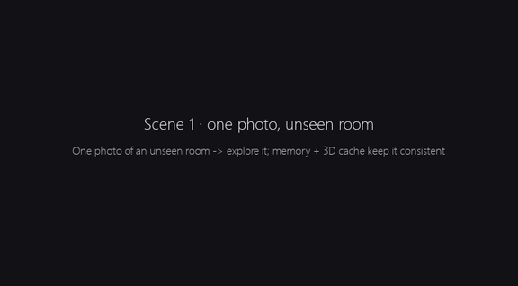
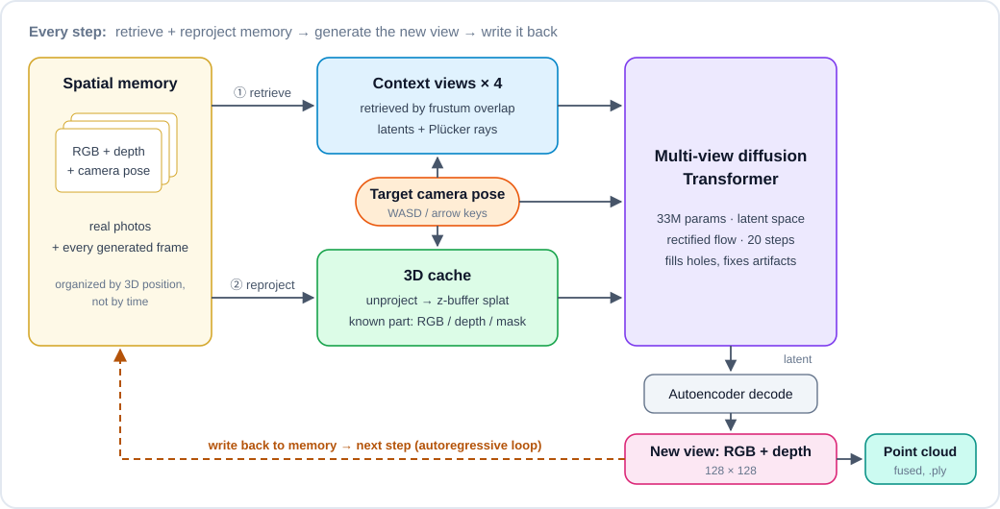
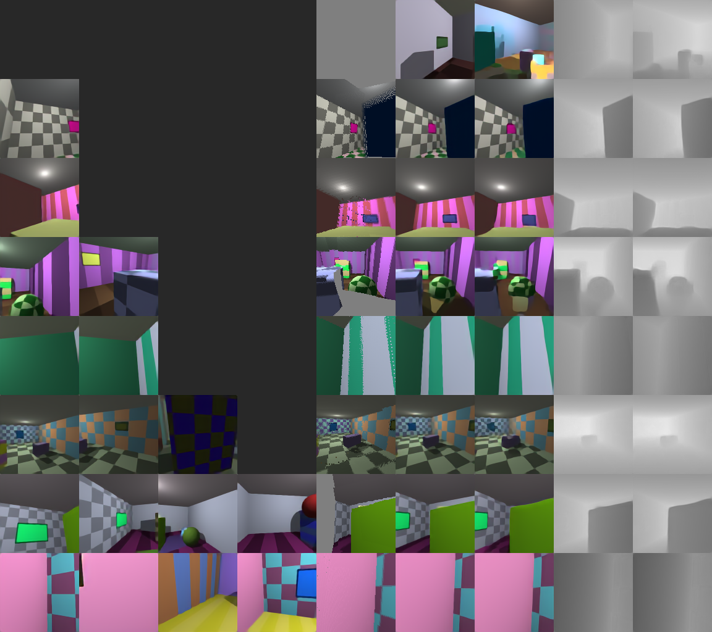
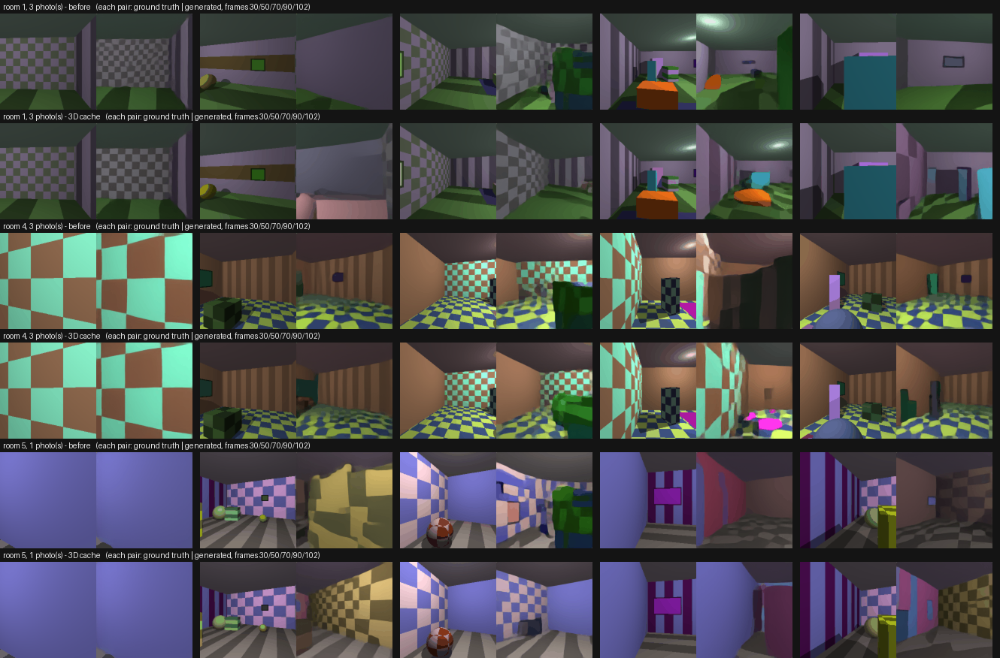

# mini-world-model

**English** | [中文](README.zh-CN.md)

A small spatial world model I built from scratch and trained on a laptop, to understand how models like
World Labs' [Atlas](https://www.worldlabs.ai/blog/atlas) work.

**posed RGB-D views → Plücker camera rays → multi-view Transformer → rectified flow in latent space →
autoregressive novel views → spatial memory + 3D cache → fused point cloud**

Give it one photo of a room it has never seen, then walk around with WASD: every step it generates the new view
(RGB + depth), writes it back into memory, and the explored room slowly turns into a 3D point cloud.



Full demo video (68 s, 3 scenes): [assets/demo_en.mp4](assets/demo_en.mp4). In each frame the big panel is the
generated view; on the right are the ground truth (never shown to the model), the 3D cache (what the model already
knows about this view), the generated depth, and a top-down map of the fused points.

> [!NOTE]
> This is a personal project for working through ideas and studying the architecture. It is independent and not
> affiliated with World Labs. Atlas has no public paper or code, so the design here follows common practice in the
> field and is my best guess, not their implementation.
>
> Everything was done on one laptop (RTX 4060, 8 GB VRAM): the data is simple procedurally generated rooms and the
> whole training budget is about 5 GPU-hours. At this scale the results are limited — 128×128, unseen areas often
> turn into blobs, objects deform, and real photos are out of reach. I can't promise anything about output quality;
> the point was to implement the key ideas end to end and measure what each one actually contributes.

## Quick start

```bash
git clone https://github.com/lyk555/mini-world-model.git
cd mini-world-model
python -m venv .venv
.venv/Scripts/python -m pip install torch --index-url https://download.pytorch.org/whl/cu126
.venv/Scripts/python -m pip install -r requirements.txt
```

(On Linux / macOS use `.venv/bin/python`.) Needs an NVIDIA GPU.

Download `mini-world-model-128-cache.pt` (~70 MB, world model + autoencoder) from
[Releases](https://github.com/lyk555/mini-world-model/releases) and put it at `runs/latent128_cache/ema.pt`. Then:

```bash
.venv/Scripts/python explore.py              # start from one photo of an unseen room
.venv/Scripts/python explore.py --imagine    # no photo at all, the model imagines the room
```

Keys: **W/S** or **↑/↓** move · **A/D** or **←/→** turn 15° · **Q/E** strafe · **R/F** look up/down ·
**G** toggle ground truth · **N** new room · **P** save the point cloud as `.ply` · **Esc** quit

Each step takes about 0.35 s on my laptop. Try looking around once, walking away, then coming back — the room
should still look the way you left it.

```bash
.venv/Scripts/python rollout.py --seed 7 --inputs 3   # offline rollout vs ground truth, GIF + .ply + PSNR
```

Open [`viewer.html`](viewer.html) in a browser and drop the two `.ply` files in to compare the generated 3D world with
the real one.

## How it works

<p align="center"></p>

**1. Data: random rooms rendered on the GPU** (`miniatlas/scene.py`). Each sample is a room with random size,
patterned walls/floor (stripes, checkers, paintings, rugs), 2–8 boxes and spheres, and a point light with shadows.
Everything is ray-cast analytically in PyTorch, so RGB, depth and camera poses are exact. With `torch.compile` it
renders ~2000 views/s at 128×128, faster than training consumes them, so every batch is a brand-new world and the
model can't memorize anything. Having exact ground truth also means every change can be measured.

**2. Latent space** (`miniatlas/autoencoder.py`). A small conv autoencoder compresses each 128×128 RGB-D view into a
32×32×8 latent (~34 dB PSNR). Diffusion runs on latents, so the 128 px model has the same token count as my first
64 px pixel-space model.

**3. Camera as geometry, not text** (`miniatlas/camera.py`). Every pixel gets its Plücker ray `(d, o × d)` as six
extra channels. All rays are expressed in a gravity-aligned frame under the target camera (origin on the floor below
it, z along its heading, y up): invariant to where you stand and which way you face, but height and pitch are kept.

**4. Multi-view diffusion Transformer** (`miniatlas/model.py`, `miniatlas/flow.py`). The noisy target view and up to
four context views go into one sequence with full attention. There is no frame-index embedding — the context is an
unordered set whose only notion of position is the rays, which is what "spatial context" means here. Target views
use fine patches (256 tokens), context views coarse ones (64 tokens each). adaLN-Zero, QK-norm, rectified flow,
20-step Euler sampling, CFG 1.5. Context views get random noise during training (and the model is told how much),
so it learns not to trust its own slightly-wrong outputs blindly.

**5. Spatial memory** (`miniatlas/world.py`). Every observed or generated view is stored with its pose. To pick the
context for a new camera, each stored frame's depth is lifted to 3D, projected into the new camera, and the four
frames that cover the view best are used. Context is chosen by *where*, not *when*.

**6. Explicit 3D cache** (`miniatlas/cache.py`). This was the change that mattered most. All real photos and the 12
most relevant generated frames are unprojected with their depth and splatted into the new camera with a z-buffer.
That gives a partial image of what is already known (RGB + depth + coverage mask, holes where nothing was seen),
which is fed to the target tokens through a zero-initialized layer. Things that were already seen get carried over
geometrically, and the model only has to fill the holes. Same idea as the 3D cache in GEN3C.

<p align="center"><br>
<sub>Training preview. Each row: 4 context views (grey = none) | 3D cache | target | generated | target depth |
generated depth. Row 1 has no context at all, so it is pure imagination.</sub></p>

## What I tried

Evaluation (`rollout.py`): give the model 1 or 3 photos of an unseen room, then generate 103 frames autoregressively
along a fixed path — spin 360° (24 frames), walk 40 steps, walk back (39 frames) — and compare with the real
renders. The walk back matters most: by then dozens of frames are the model's own output, so any drift shows up.
Numbers are PSNR in dB, averaged over 6 random rooms.

| Version | Idea | 1 photo (spin / walk / back) | 3 photos (spin / walk / back) | Training |
|---|---|---|---|---|
| v1 pixels, 64 px | baseline | not on the same rooms | not on the same rooms | 1.5 h |
| v2 latent, 128 px | autoencoder + latent diffusion | 15.6 / 16.2 / 13.8 | 16.8 / 17.4 / 14.9 | 0.5 h + 2.3 h |
| v3 + self-forcing | train on its own outputs | 15.0 / 15.6 / 13.4 | 17.1 / 17.5 / 14.6 | +1 h |
| **v4 + 3D cache** | reproject memory as geometry | 15.5 / 16.0 / **15.2** | **18.1 / 18.8 / 17.2** | +1 h |

- **v1 → v2.** 64×64 was too blurry, and 128 px in pixel space would cost 4× the compute. Moving to latents kept the
  token count the same and made edges (checkers, stripes, frames) much sharper.
- **v2 → v3, didn't work.** My guess was that drift comes from training only on clean context while inference feeds
  the model its own imperfect frames. So I replaced some context views with the model's own regenerations
  (`miniatlas/selfforce.py`). PSNR stayed flat and the drift didn't improve
  ([comparison](assets/selfforce_comparison.png)). The real problem was that the model only remembers the room
  through a few 2D images and re-imagines everything at every step.
- **v2 → v4, worked.** Making the memory explicitly 3D raised PSNR on the walk back by 1.4 dB (1 photo) and 2.3 dB
  (3 photos), and most of the blobs that used to appear mid-rollout became the correct walls and objects again:

<p align="center"><br>
<sub>Odd rows: v2. Even rows: v4 (3D cache). Each pair is ground truth | generated, at frames 30 / 50 / 70 / 90 / 102.</sub></p>

With only one photo most of the room has never been seen, so the model invents something plausible but different
(a box becomes a painting), which PSNR counts as wrong. That's why the 1-photo numbers are lower and improve less.

## Train from scratch

All times are on an RTX 4060 Laptop (8 GB).

```bash
# 1. autoencoder: 128×128 RGB-D -> 32×32×8 latents (~30 min)
.venv/Scripts/python train_ae.py --out runs/ae128 --res 128 --steps 8000

# 2. latent world model (~2.3 h)
.venv/Scripts/python train.py --out runs/latent128 --ae runs/ae128/ae.pt --steps 30000

# 3. fine-tune with the 3D cache (~1 h)
.venv/Scripts/python train.py --out runs/latent128_cache --ae runs/ae128/ae.pt \
    --init runs/latent128/latest.pt --cache_extra 4 --bs 16 --steps 15000 --lr 1e-4 --warmup 200
```

A preview image is written to `runs/<name>/preview_XXXXXX.png` every 1000 steps, and rerunning the same command
resumes from `latest.pt`. The 64 px pixel-space model is `train.py --out runs/main --steps 30000`; the self-forcing
command is at the top of `train.py`. To re-record the demo: `python make_demo.py --lang en`.

## Code

| File | What it does | Concept |
|---|---|---|
| `miniatlas/scene.py` | random rooms, batched GPU ray caster, camera sampling for training | data, poses |
| `miniatlas/camera.py` | camera conventions, Plücker rays, gravity-aligned frame, (un)projection | camera conditioning |
| `miniatlas/autoencoder.py` | RGB-D ↔ 4× downsampled latents | latent diffusion |
| `miniatlas/model.py` | multi-view DiT: adaLN-Zero, QK-norm, context noise level, 3D cache input | core architecture, spatial context |
| `miniatlas/flow.py` | rectified-flow loss and Euler sampler with CFG | rectified flow |
| `miniatlas/data.py` | builds training batches on the fly (context sampling, noise augmentation, cache) | training setup |
| `miniatlas/cache.py` | unproject + z-buffer splat, pose/depth jitter for training | 3D cache |
| `miniatlas/world.py` | spatial memory, retrieval, autoregressive generation, point-cloud fusion | inference, 3D output |
| `miniatlas/selfforce.py` | training on the model's own regenerations (didn't help) | experiment |
| `train_ae.py`, `train.py` | training scripts | |
| `explore.py` | interactive exploration (pygame) | |
| `rollout.py` | offline evaluation: spin → walk → walk back | evaluation |
| `make_demo.py` | records the demo video | |
| `viewer.html` | point-cloud viewer (three.js) | |

## Differences from the real Atlas

| | mini-world-model | Atlas |
|---|---|---|
| Scale | 128×128, 33M params, ~5 GPU-hours | up to 1440p, size not public |
| Data | procedural rooms | real images, video, poses, depth |
| Latent space | small autoencoder trained on the synthetic rooms | latent diffusion, details not public |
| Camera encoding | Plücker rays (my assumption) | not public |
| Memory | 4 retrieved views + a point-cloud 3D cache | spatial context, details not public |
| Inference | full sequence recomputed every step | KV cache and other LLM serving tricks |

## Things that bit me

- **8 GB VRAM fills up quietly.** On Windows, when VRAM runs out the driver spills into shared system memory instead
  of raising an OOM error, and training drops from ~5 it/s to almost nothing. The giveaway was GPU power falling from
  ~90 W to ~35 W at "100% utilization". It happened twice (the first full run and the self-forcing run); a smaller
  batch fixed it both times.
- **`torch.compile` was worth it.** It needs `triton-windows` on Windows, but made the model ~4× and the ray caster
  ~2.5× faster, which is what made training at 128 px feasible on a laptop.
- **pygame and a Chinese input method.** SDL turns on text input by default, so the IME swallowed W/A/S/D and the
  explorer looked frozen. `pygame.key.stop_text_input()` fixed it.
- **Same noise, same hallucination.** The rollout script seeded each frame by its index, and in several rooms both
  models produced the same dark-green blob at frame 70. In regions that memory doesn't cover, the content is decided
  by the noise rather than by what was seen.
- **More "realistic" training wasn't the fix.** Self-forcing made the training inputs look more like inference, but
  that wasn't the bottleneck. Giving the model an explicit 3D memory was.

## Limitations

- Only trained on synthetic rooms; real photos don't work. Going there would need posed real video (RealEstate10K,
  DL3DV), a much better VAE, and one or two orders of magnitude more compute.
- The 3D cache keeps things consistent, not pretty: if an unseen area comes out as a blob the first time, it stays a
  blob. Object edges are soft.
- 128×128 and ~0.35 s per step is far from smooth real-time. Consistency distillation down to ~4 sampling steps
  would be the next thing I'd try.
- The cache is plain point splatting; 3D Gaussians would give cleaner reprojection and better 3D export.
- Evaluation uses only 6 rooms and the numbers are noisy; read the table as a trend.

## References

- World Labs, [*Atlas*](https://www.worldlabs.ai/blog/atlas) (2026) — the inspiration (this is not an official implementation)
- Peebles & Xie, *Scalable Diffusion Models with Transformers (DiT)* — [arXiv:2212.09748](https://arxiv.org/abs/2212.09748)
- Liu et al., *Flow Straight and Fast: Rectified Flow* — [arXiv:2209.03003](https://arxiv.org/abs/2209.03003)
- Esser et al., *Scaling Rectified Flow Transformers for High-Resolution Image Synthesis (SD3)* — [arXiv:2403.03206](https://arxiv.org/abs/2403.03206)
- Gao et al., *CAT3D: Create Anything in 3D with Multi-View Diffusion Models* — [arXiv:2405.10314](https://arxiv.org/abs/2405.10314)
- Ren et al., *GEN3C: 3D-Informed World-Consistent Video Generation with Precise Camera Control* — [arXiv:2503.03751](https://arxiv.org/abs/2503.03751)
- Chen et al., *Diffusion Forcing: Next-token Prediction Meets Full-Sequence Diffusion* — [arXiv:2407.01392](https://arxiv.org/abs/2407.01392)
- Alonso et al., *Diffusion for World Modeling: Visual Details Matter in Atari (DIAMOND)* — [arXiv:2405.12399](https://arxiv.org/abs/2405.12399)
- Bruce et al., *Genie: Generative Interactive Environments* — [arXiv:2402.15391](https://arxiv.org/abs/2402.15391)
- Valevski et al., *Diffusion Models Are Real-Time Game Engines (GameNGen)* — [arXiv:2408.14837](https://arxiv.org/abs/2408.14837)

## License

[MIT](LICENSE)
