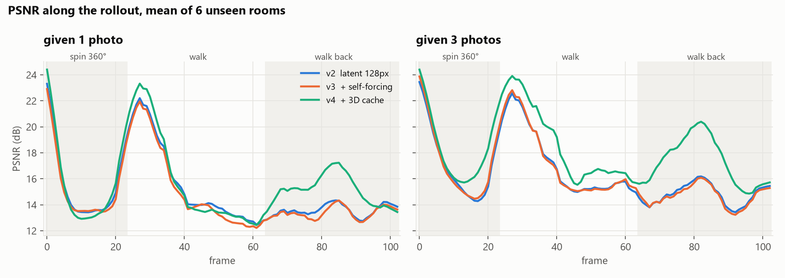
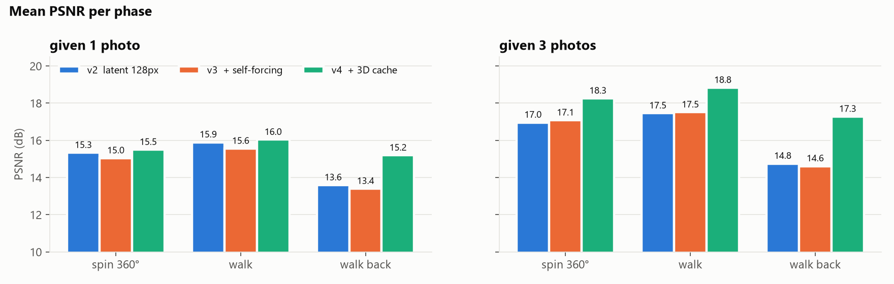
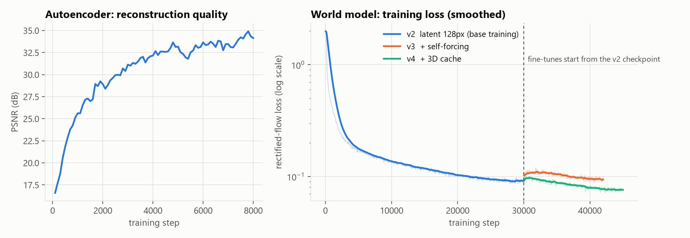

# mini-world-model

**English** | [中文](README.zh-CN.md)

A small spatial world model I built from scratch and trained on a laptop, to understand how models like
World Labs' [Atlas](https://www.worldlabs.ai/blog/atlas) work.

**posed RGB-D views → Plücker camera rays → multi-view Transformer → rectified flow in latent space →
autoregressive novel views → spatial memory + 3D cache → fused point cloud**

Give it one photo of a room it has never seen, then walk around with WASD: every step it generates the new view
(RGB + depth), writes it back into memory, and the explored room slowly turns into a 3D point cloud.


Full demo video (68 s, 3 scenes): [assets/demo_en.mp4](assets/demo_en.mp4). In each frame the big panel is the
generated view; on the right are the ground truth (never shown to the model), the 3D cache (what the model already
knows about this view), the generated depth, and a top-down map of the fused points.

> [!NOTE]
> This is a personal project for working through ideas and studying the architecture. It is independent and not
> affiliated with World Labs. Atlas has no public paper or code, so the design here follows common practice in the
> field and is my best guess, not their implementation.
>
> Everything was done on one laptop (RTX 4060, 8 GB VRAM): the data is simple procedurally generated rooms and the
> whole training budget is about 5 GPU-hours. At this scale the results are limited — 128×128, unseen areas often
> turn into blobs, objects deform, and real photos are out of reach. I can't promise anything about output quality;
> the point was to implement the key ideas end to end and measure what each one actually contributes.

## Quick start

```bash
git clone https://github.com/lyk555/mini-world-model.git
cd mini-world-model
python -m venv .venv
.venv/Scripts/python -m pip install torch --index-url https://download.pytorch.org/whl/cu126
.venv/Scripts/python -m pip install -r requirements.txt
```

(On Linux / macOS use `.venv/bin/python`.) Needs an NVIDIA GPU.

Download `mini-world-model-128-cache.pt` (~70 MB, world model + autoencoder) from
[Releases](https://github.com/lyk555/mini-world-model/releases) and put it at `runs/latent128_cache/ema.pt`. Then:

```bash
.venv/Scripts/python explore.py              # start from one photo of an unseen room
.venv/Scripts/python explore.py --imagine    # no photo at all, the model imagines the room
```

Keys: **W/S** or **↑/↓** move · **A/D** or **←/→** turn 15° · **Q/E** strafe · **R/F** look up/down ·
**G** toggle ground truth · **N** new room · **P** save the point cloud as `.ply` · **Esc** quit

Each step takes about 0.35 s on my laptop. Try looking around once, walking away, then coming back — the room
should still look the way you left it.

```bash
.venv/Scripts/python rollout.py --seed 7 --inputs 3   # offline rollout vs ground truth, GIF + .ply + PSNR
```

Open [`viewer.html`](viewer.html) in a browser and drop the two `.ply` files in to compare the generated 3D world with
the real one.

## How it works

<p align="center"></p>

**1. Data: random rooms rendered on the GPU** (`miniatlas/scene.py`). Each sample is a room with random size,
patterned walls/floor (stripes, checkers, paintings, rugs), 2–8 boxes and spheres, and a point light with shadows.
Everything is ray-cast analytically in PyTorch, so RGB, depth and camera poses are exact. With `torch.compile` it
renders ~2000 views/s at 128×128, faster than training consumes them, so every batch is a brand-new world and the
model can't memorize anything. Having exact ground truth also means every change can be measured.

**2. Latent space** (`miniatlas/autoencoder.py`). A small conv autoencoder compresses each 128×128 RGB-D view into a
32×32×8 latent (~34 dB PSNR). Diffusion runs on latents, so the 128 px model has the same token count as my first
64 px pixel-space model.

**3. Camera as geometry, not text** (`miniatlas/camera.py`). Every pixel gets its Plücker ray `(d, o × d)` as six
extra channels. All rays are expressed in a gravity-aligned frame under the target camera (origin on the floor below
it, z along its heading, y up): invariant to where you stand and which way you face, but height and pitch are kept.

**4. Multi-view diffusion Transformer** (`miniatlas/model.py`, `miniatlas/flow.py`). The noisy target view and up to
four context views go into one sequence with full attention. There is no frame-index embedding — the context is an
unordered set whose only notion of position is the rays, which is what "spatial context" means here. Target views
use fine patches (256 tokens), context views coarse ones (64 tokens each). adaLN-Zero, QK-norm, rectified flow,
20-step Euler sampling, CFG 1.5. Context views get random noise during training (and the model is told how much),
so it learns not to trust its own slightly-wrong outputs blindly.

**5. Spatial memory** (`miniatlas/world.py`). Every observed or generated view is stored with its pose. To pick the
context for a new camera, each stored frame's depth is lifted to 3D, projected into the new camera, and the four
frames that cover the view best are used. Context is chosen by *where*, not *when*.

**6. Explicit 3D cache** (`miniatlas/cache.py`). This was the change that mattered most. All real photos and the 12
most relevant generated frames are unprojected with their depth and splatted into the new camera with a z-buffer.
That gives a partial image of what is already known (RGB + depth + coverage mask, holes where nothing was seen),
which is fed to the target tokens through a zero-initialized layer. Things that were already seen get carried over
geometrically, and the model only has to fill the holes. Same idea as the 3D cache in GEN3C.

<p align="center"><br>
<sub>Training preview. Each row: 4 context views (grey = none) | 3D cache | target | generated | target depth |
generated depth. Row 1 has no context at all, so it is pure imagination.</sub></p>

## Results

The test: give the model 1 or 3 photos of a room it has never seen, then let it generate 103 frames on its own
along a fixed path — spin 360°, walk 40 steps, walk back — and compare every frame with the real render.
By the walk back, dozens of frames in memory are the model's own output, so this is where drift shows.

<p align="center"><br>
<sub>Same rooms, same path. Odd rows: v2 (spatial memory only). Even rows: v4 (with the 3D cache).
Each pair is ground truth | generated, at frames 30 / 50 / 70 / 90 / 102.</sub></p>

<p align="center"></p>

<p align="center"><br>
<sub>v2: 128 px latent model with spatial memory. v3: v2 fine-tuned on its own regenerated frames (self-forcing).
v4: v2 fine-tuned with the 3D cache. Self-forcing didn't help; the 3D cache mostly pays off on the walk back,
where the model returns to places it has already generated.</sub></p>

With a single photo most of the room has never been seen, so the model invents something plausible but different
(a box becomes a painting) and PSNR counts that as an error — the 1-photo numbers are lower for that reason.

<p align="center"><br>
<sub>Left: the autoencoder reaches ~34 dB reconstruction PSNR in 8k steps. Right: world-model loss; the two
fine-tunes start from the v2 checkpoint at step 30k (their losses aren't directly comparable — v3 sees harder
context, v4 gets extra input).</sub></p>

## Train from scratch

All times are on an RTX 4060 Laptop (8 GB).

```bash
# 1. autoencoder: 128×128 RGB-D -> 32×32×8 latents (~30 min)
.venv/Scripts/python train_ae.py --out runs/ae128 --res 128 --steps 8000

# 2. latent world model (~2.3 h)
.venv/Scripts/python train.py --out runs/latent128 --ae runs/ae128/ae.pt --steps 30000

# 3. fine-tune with the 3D cache (~1 h)
.venv/Scripts/python train.py --out runs/latent128_cache --ae runs/ae128/ae.pt \
    --init runs/latent128/latest.pt --cache_extra 4 --bs 16 --steps 15000 --lr 1e-4 --warmup 200
```

A preview image is written to `runs/<name>/preview_XXXXXX.png` every 1000 steps, and rerunning the same command
resumes from `latest.pt`. The 64 px pixel-space model is `train.py --out runs/main --steps 30000`; the self-forcing
command is at the top of `train.py`. To re-record the demo: `python make_demo.py --lang en`.

## Differences from the real Atlas

| | mini-world-model | Atlas |
|---|---|---|
| Scale | 128×128, 33M params, ~5 GPU-hours | up to 1440p, size not public |
| Data | procedural rooms | real images, video, poses, depth |
| Latent space | small autoencoder trained on the synthetic rooms | latent diffusion, details not public |
| Camera encoding | Plücker rays (my assumption) | not public |
| Memory | 4 retrieved views + a point-cloud 3D cache | spatial context, details not public |
| Inference | full sequence recomputed every step | KV cache and other LLM serving tricks |

## Limitations

- Only trained on synthetic rooms; real photos don't work. Going there would need posed real video (RealEstate10K,
  DL3DV), a much better VAE, and one or two orders of magnitude more compute.
- The 3D cache keeps things consistent, not pretty: if an unseen area comes out as a blob the first time, it stays a
  blob. Object edges are soft.
- 128×128 and ~0.35 s per step is far from smooth real-time. Consistency distillation down to ~4 sampling steps
  would be the next thing I'd try.
- The cache is plain point splatting; 3D Gaussians would give cleaner reprojection and better 3D export.
- Evaluation uses only 6 rooms and the numbers are noisy; read the plots as trends.

## References

- World Labs, [*Atlas*](https://www.worldlabs.ai/blog/atlas) (2026) — the inspiration (this is not an official implementation)
- Peebles & Xie, *Scalable Diffusion Models with Transformers (DiT)* — [arXiv:2212.09748](https://arxiv.org/abs/2212.09748)
- Liu et al., *Flow Straight and Fast: Rectified Flow* — [arXiv:2209.03003](https://arxiv.org/abs/2209.03003)
- Esser et al., *Scaling Rectified Flow Transformers for High-Resolution Image Synthesis (SD3)* — [arXiv:2403.03206](https://arxiv.org/abs/2403.03206)
- Gao et al., *CAT3D: Create Anything in 3D with Multi-View Diffusion Models* — [arXiv:2405.10314](https://arxiv.org/abs/2405.10314)
- Ren et al., *GEN3C: 3D-Informed World-Consistent Video Generation with Precise Camera Control* — [arXiv:2503.03751](https://arxiv.org/abs/2503.03751)
- Chen et al., *Diffusion Forcing: Next-token Prediction Meets Full-Sequence Diffusion* — [arXiv:2407.01392](https://arxiv.org/abs/2407.01392)
- Alonso et al., *Diffusion for World Modeling: Visual Details Matter in Atari (DIAMOND)* — [arXiv:2405.12399](https://arxiv.org/abs/2405.12399)
- Bruce et al., *Genie: Generative Interactive Environments* — [arXiv:2402.15391](https://arxiv.org/abs/2402.15391)
- Valevski et al., *Diffusion Models Are Real-Time Game Engines (GameNGen)* — [arXiv:2408.14837](https://arxiv.org/abs/2408.14837)

## License

[MIT](LICENSE)
