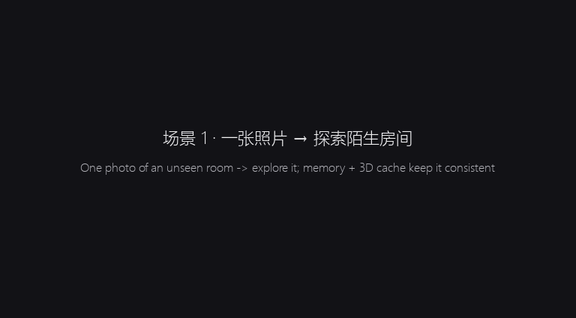
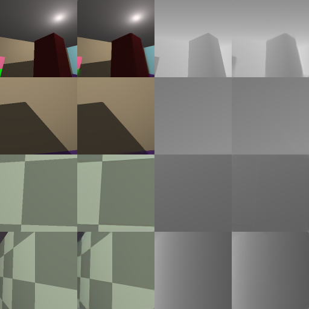
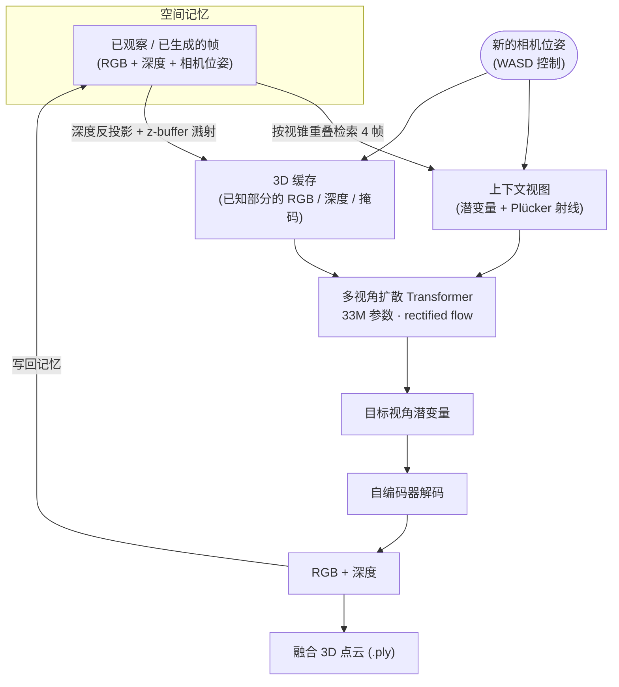

# mini-world-model

**一个能在笔记本 GPU 上从零训练的迷你空间世界模型。** 给它一张（或几张）没见过的房间照片，它就能让你在房间里自由走动、
转头，实时生成每一个新视角的画面和深度，并把看到的一切融合成一个 3D 点云世界。

> A from-scratch, laptop-scale spatial world model inspired by World Labs' *Atlas*: a camera-conditioned
> autoregressive latent-diffusion transformer with spatial memory and an explicit 3D cache.
> Trained in ~5 GPU-hours on an RTX 4060 Laptop (8 GB). Unofficial; not affiliated with World Labs.



🎬 **完整演示视频（68 秒，3 个场景）：[assets/demo.mp4](assets/demo.mp4)**
— 每帧左边是模型生成的画面；右边依次是真实画面（模型看不到，仅供对比）、3D 缓存（模型"已经知道"的内容）、
生成的深度、以及由生成结果融合出的俯视地图。

---

## 目录

- [项目思路](#项目思路)
- [方法](#方法)
- [迭代过程与结果](#迭代过程与结果)
- [快速开始](#快速开始)
- [从零训练](#从零训练)
- [代码结构](#代码结构)
- [局限与下一步](#局限与下一步)
- [参考](#参考)

---

## 项目思路

### 什么是"世界模型"

世界模型是一个能**预测世界在某个动作之后会变成什么样**的生成模型。对游戏世界模型（DIAMOND、Genie、GameNGen）来说，
动作是按键，预测的是下一帧；对*空间*世界模型来说，动作就是**相机运动**——"往前走一步、向左转 15° 之后，我会看到什么？"
把这个预测一步步滚动下去，模型就成了一个可以自由探索的模拟器。

### Atlas 做对了什么

2026 年 9 月，World Labs 发布了 Atlas。从公开信息看，它有几个关键设计：

1. **自回归扩散 Transformer**：像 LLM 一样一段段地生成，每一段内部用扩散（rectified flow）去噪，且在潜空间里进行。
2. **相机位姿是一等公民**：上下文里的每张图像和深度图都绑定一个**显式的 3D 相机位姿**。相机控制是几何输入，
   而不是"向左平移"之类的文字。
3. **空间上下文**：上下文按 3D 空间组织，而不是按时间顺序——回到一个地方时，模型参考的是之前在这里看到的东西。
4. **原生 3D 输出**：除了图像还输出深度，可以重建成点云 / 3D 高斯。

Atlas 的参数量、数据和训练细节都没有公开，计算量也远超个人能力。所以这个项目的目标不是"复制 Atlas"，而是：

> **在一台笔记本上，用最小的规模把这四个设计全部跑通，并亲手验证每个设计到底起什么作用。**

### 为什么用合成数据

真实的带位姿视频数据（RealEstate10K、DL3DV）需要大量预处理，笔记本的算力也撑不起在真实数据上训练。
于是我写了一个 **GPU 光线投射渲染器**，实时生成无限多的随机房间：带花纹的墙面和地板、挂画、地毯、各种方块和球体、
点光源和阴影。每一帧的 RGB、深度和相机位姿都是**精确已知**的，所以不需要下载任何数据集，训练时边渲染边学；
而且因为有真值，模型的每一个改进都可以**定量地**衡量。

<p align="center"><br>
<sub>程序化生成的房间（每行：原图 | 自编码器重建 | 原深度 | 重建深度）</sub></p>

---

## 方法



### 1. 数据：程序化房间 + GPU 光线投射（`miniatlas/scene.py`）

每个场景是一个随机尺寸的房间，墙 / 地 / 顶有纯色、条纹或棋盘格图案，墙上有画、地上有地毯，房间里有 2~8 个随机的
球体和（绕竖直轴旋转的）方块。渲染器对所有物体做解析求交，带点光源硬阴影和 2× 超采样抗锯齿，用 `torch.compile`
融合后每秒能渲染约 2000 张 128×128 的视图——比训练消耗得还快，所以数据完全在线生成。

训练样本 = 一个目标视角 + 0~4 个上下文视角。上下文有的离目标很近（模拟一步步走动），有的在房间任意位置
（模拟稀疏视角重建）；8% 的样本没有任何上下文，模型由此学会"凭空想象"一个房间。

### 2. 潜空间：卷积自编码器（`miniatlas/autoencoder.py`）

和 Atlas / Stable Diffusion 一样，先把每张 128×128 的 RGB + 深度压缩成 32×32×8 的潜变量（重建 PSNR ≈ 34 dB），
扩散模型只在潜空间里工作。这样 128px 模型的 token 数和 64px 像素空间模型一样，算力几乎不变。
训练自编码器时在潜变量上加噪声，让解码器能容忍扩散模型生成的不完美潜变量。

### 3. 相机条件：Plücker 射线 + 重力对齐坐标系（`miniatlas/camera.py`）

每个像素的相机射线用 Plücker 坐标 `(d, o × d)` 表示（CAT3D 等多视角扩散模型的标准做法），作为 6 个额外通道和图像
拼在一起。所有射线都表达在**目标相机的重力对齐参考系**里：原点在目标相机正下方的地面，z 轴指向它的朝向，y 轴朝上。
这让模型对整体的水平平移和转向不变，但保留了高度和俯仰——地面永远在 y = 0。

### 4. 模型：多视角扩散 Transformer（`miniatlas/model.py`）

- 所有视图（目标 + 上下文）放进**同一个序列做全注意力**，没有帧序号嵌入——上下文是一个**无序集合**，位置信息只来自
  几何。这就是 "spatial context"：任何时间、任何顺序拍到的视图都能作为上下文。
- 目标视图用细 patch（256 个 token），上下文用粗 patch（每张 64 个 token），5 张视图的序列只有 512 个 token。
- adaLN-Zero 时间条件、QK-norm；**rectified flow** 训练（logit-normal 时间步），20~25 步 Euler 采样，CFG 1.5。
- **上下文噪声增强**（类似 Diffusion Forcing / GameNGen）：训练时给上下文加随机噪声并告诉模型噪声等级；
  推理时给模型自己生成的帧标上一个小噪声等级，让它不要盲目相信自己的输出。

### 5. 空间记忆（`miniatlas/world.py`）

每张观察到的或生成的视图连同位姿存进记忆。生成新视角前，把每帧的深度反投影成一组探针点、投影到新相机里，按
**视锥重叠程度**挑出覆盖最好的 4 帧作为上下文（去掉几乎重复的视角，真实照片优先）。上下文是按"空间"而不是按"最近"
选的，所以回到旧地方时会参考当时看到的东西。

### 6. 显式 3D 缓存（`miniatlas/cache.py`）——最关键的改进

只靠几张 2D 上下文图，模型每一步都要"凭印象"把整个画面重画一遍，细节会一点点漂移：物体变形、消失，花纹变成色块。
解决办法是把记忆**真正地变成 3D**：

1. 把所有真实照片和最相关的 12 帧生成帧，按深度反投影成 3D 点；
2. 用 z-buffer 把这些点溅射（splat）到新相机里，得到一张"已知部分"的图：RGB + 深度 + 覆盖掩码，没见过的地方是空洞；
3. 把这张图作为目标 token 的额外输入（零初始化的线性层，从已训练的模型微调）。

于是看过的内容按几何**直接搬过来**，模型只需要补洞、修补溅射的瑕疵。训练时额外渲染 4 个"历史视角"进缓存，
并对缓存的来源加位姿、深度和模糊扰动，模拟生成帧的不完美。思路与 GEN3C 的 3D cache 相同。

<p align="center"><br>
<sub>训练预览。每行：4 个上下文视图（灰 = 无）| 3D 缓存 | 真实目标 | 生成结果 | 真实深度 | 生成深度。
第一行没有任何上下文，模型完全靠想象；有缓存的行，生成结果几乎与真值一致，空洞被合理补全。</sub></p>

---

## 迭代过程与结果

评测方式（`rollout.py`）：给模型 1 或 3 张没见过房间的照片，沿固定轨迹自回归生成 103 帧——
**原地转一圈（24 帧）→ 往前走 40 步 → 原路返回（39 帧）**——逐帧与真实渲染比较 PSNR。
"返回"阶段最能说明问题：此时模型已经生成了几十帧，误差是否累积、世界是否还保持原样，都会体现在这里。
以下数字是 6 个随机房间的平均（dB，越高越好）。

| 版本 | 思路 | 1 张照片（转圈 / 行走 / 返回） | 3 张照片（转圈 / 行走 / 返回） | 训练时间 |
|---|---|---|---|---|
| v1 像素空间 64px | 基线 | 未在同一组房间上评测 | 未在同一组房间上评测 | 1.5 h |
| v2 潜空间 128px | 自编码器 + 潜空间扩散 | 15.6 / 16.2 / 13.8 | 16.8 / 17.4 / 14.9 | 0.5 h + 2.3 h |
| v3 + self-forcing | 用自己的输出做上下文训练 | 15.0 / 15.6 / 13.4 | 17.1 / 17.5 / 14.6 | +1 h |
| **v4 + 3D 缓存** | **记忆重投影为几何条件** | 15.5 / 16.0 / **15.2** | **18.1 / 18.8 / 17.2** | +1 h |

**v1 → v2：分辨率。** 64×64 像素空间的结果太模糊，而直接在 128px 像素空间训练算力要翻 4 倍。改用潜空间后
token 数不变，画面锐利了很多（棋盘格、条纹、画框边缘都清晰可辨）。

**v2 → v3：self-forcing（失败的尝试）。** 长距离漫游的漂移，一个常见解释是"训练时只见过干净的上下文，推理时却要吃
自己生成的、有误差的帧"。于是我在训练时把部分上下文换成模型自己的重建（SDEdit 式部分加噪再去噪、两轮叠加误差），
并加上"这帧是生成的"标记。结果 PSNR 基本持平，漂移没有明显改善
（[对比图](assets/selfforce_comparison.png)）。
**结论：问题不在于"模型不习惯吃自己的输出"，而在于它只能通过几张 2D 图间接地记住 3D 世界，每一步都在重新想象。**

**v2 → v4：3D 缓存（成功）。** 基于上面的结论，把记忆显式地变成 3D 几何。"返回"阶段 PSNR 提升
1.4 dB（1 张照片）和 2.3 dB（3 张照片），中途乱冒的色块大多变回了正确的墙面和物体：

<p align="center"><br>
<sub>奇数行：v2；偶数行：v4（3D 缓存）。每对图：真实 | 生成，取轨迹的第 30 / 50 / 70 / 90 / 102 帧。</sub></p>

> 关于数字：PSNR 衡量的是与真值的接近程度。只给 1 张照片时，房间大部分区域模型从没见过，它会想象出**合理但不同**
> 的内容（比如把一个方块想象成一幅画），这在 PSNR 上会被算作"错误"。所以 1 张照片的数字天然偏低，提升也更小。

---

## 快速开始

需要 NVIDIA GPU（在 RTX 4060 Laptop 8GB、Windows 11 上开发）和 Python 3.10+。

```bash
git clone https://github.com/lyk555/mini-world-model.git
cd mini-world-model
python -m venv .venv
.venv/Scripts/python -m pip install torch --index-url https://download.pytorch.org/whl/cu126
.venv/Scripts/python -m pip install -r requirements.txt
```

（Linux / macOS 把 `.venv/Scripts/python` 换成 `.venv/bin/python`。）

**下载预训练权重**（约 70 MB，包含世界模型和自编码器）：从
[Releases](https://github.com/lyk555/mini-world-model/releases) 下载 `mini-world-model-128-cache.pt`，
放到 `runs/latent128_cache/ema.pt`。

### 交互式漫游

```bash
.venv/Scripts/python explore.py              # 从一张照片出发，探索一个没见过的房间
.venv/Scripts/python explore.py --imagine    # 不给照片，让模型凭空想象一个房间
```

| 按键 | 作用 |
|---|---|
| W / ↑ 、 S / ↓ | 前进 / 后退 0.3 m |
| A / ← 、 D / → | 左转 / 右转 15° |
| Q / E | 左 / 右平移 |
| R / F | 抬头 / 低头 |
| G | 显示 / 隐藏真实画面（模型看不到，仅供对比） |
| N | 换一个新房间 |
| P | 把当前融合的 3D 点云保存为 `.ply` |

在 RTX 4060 Laptop 上每步约 0.35 秒。推荐玩法：先原地转一圈，再走开，最后走回原处，看房间是否还是原来的样子。
（如果按键没反应：先点一下窗口；用中文输入法时可以切到英文或用方向键。）

### 离线评测与 3D 重建

```bash
.venv/Scripts/python rollout.py --seed 7 --inputs 3
```

输出到 `outputs/rollout_seed7_in3/`：逐帧对比的 `rollout.gif`、模型生成的 3D 世界 `generated.ply`、
真实的 `groundtruth.ply`，以及各阶段的 PSNR。用浏览器打开 [`viewer.html`](viewer.html)，把两个 `.ply` 拖进去即可并排对比。

### 重新录制演示视频

```bash
.venv/Scripts/python make_demo.py --out assets/demo.mp4 --gif assets/demo.gif
```

---

## 从零训练

所有时间均在 RTX 4060 Laptop (8GB) 上测得。

```bash
# 1. 自编码器：128×128 RGB+深度 → 32×32×8 潜变量（~30 分钟）
.venv/Scripts/python train_ae.py --out runs/ae128 --res 128 --steps 8000

# 2. 潜空间世界模型（~2.3 小时）
.venv/Scripts/python train.py --out runs/latent128 --ae runs/ae128/ae.pt --steps 30000

# 3. 加入 3D 缓存微调（~1 小时）
.venv/Scripts/python train.py --out runs/latent128_cache --ae runs/ae128/ae.pt \
    --init runs/latent128/latest.pt --cache_extra 4 --bs 16 --steps 15000 --lr 1e-4 --warmup 200
```

训练每 1000 步保存一张预览图 `runs/<名字>/preview_XXXXXX.png`；中断后重新运行同一命令会从 `latest.pt` 续训。
其他实验：64px 像素空间版本 `train.py --out runs/main --steps 30000`；self-forcing 版本的命令见 `train.py` 顶部。

在 Windows 上，`torch.compile` 需要 `triton-windows`（已写入 requirements）；没有它时加 `--no-compile`，速度约慢 3~4 倍。

---

## 代码结构

```
miniatlas/
  scene.py        程序化房间 + 批量 GPU 光线投射渲染 + 训练视角采样
  camera.py       相机约定、Plücker 射线、重力对齐参考系、深度编码、投影 / 反投影
  autoencoder.py  视图自编码器（RGB+深度 ↔ 4× 下采样潜变量）
  model.py        多视角扩散 Transformer（adaLN-Zero、QK-norm、上下文噪声等级 / 生成标记 / 3D 缓存输入）
  flow.py         rectified flow 损失与 Euler 采样器（CFG）
  data.py         在线构造训练 batch（上下文采样、噪声增强、3D 缓存）
  cache.py        3D 缓存：深度反投影 + z-buffer 溅射 + 训练时扰动
  selfforce.py    self-forcing（实验性，未采用）
  world.py        推理：空间记忆、检索、自回归生成、点云融合、PLY 导出
train_ae.py       训练自编码器
train.py          训练世界模型（像素空间 / 潜空间 / self-forcing / 3D 缓存）
rollout.py        离线评测：转圈 → 行走 → 返回，与真值对比
explore.py        交互式漫游（pygame）
make_demo.py      录制演示视频
viewer.html       浏览器点云查看器（three.js）
```

---

## 局限与下一步

- **只在合成房间上训练**，不能处理真实照片。迈向真实场景需要带位姿的真实视频（RealEstate10K、DL3DV）、
  更强的预训练 VAE，以及大一到两个数量级的算力。
- **3D 缓存保证"一致"，不保证"好看"。** 模型第一次想象没见过的区域时如果画成了色块，这些色块也会被忠实地保留下来；
  物体边缘偏软、有"融化"感。改进方向是提升第一次想象的质量：更大的模型、更长的训练、对未覆盖区域加大 CFG。
- **分辨率 128×128，每步约 0.35 秒。** 可以用一致性蒸馏把采样从 20 步降到 4 步左右，接近流畅实时。
- 3D 缓存目前是简单的点云溅射；换成 3D 高斯表示可以得到更干净的重投影和更好的 3D 导出。

---

## 参考

- World Labs, *Atlas* (2026) — [发布推文](https://x.com/theworldlabs/status/2094839756329041984)，本项目的灵感来源（非官方实现）
- Peebles & Xie, *Scalable Diffusion Models with Transformers (DiT)* — [arXiv:2212.09748](https://arxiv.org/abs/2212.09748)
- Liu et al., *Flow Straight and Fast: Rectified Flow* — [arXiv:2209.03003](https://arxiv.org/abs/2209.03003)
- Esser et al., *Scaling Rectified Flow Transformers for High-Resolution Image Synthesis (SD3)* — [arXiv:2403.03206](https://arxiv.org/abs/2403.03206)
- Gao et al., *CAT3D: Create Anything in 3D with Multi-View Diffusion Models* — [arXiv:2405.10314](https://arxiv.org/abs/2405.10314)
- Ren et al., *GEN3C: 3D-Informed World-Consistent Video Generation with Precise Camera Control* — [arXiv:2503.03751](https://arxiv.org/abs/2503.03751)
- Chen et al., *Diffusion Forcing: Next-token Prediction Meets Full-Sequence Diffusion* — [arXiv:2407.01392](https://arxiv.org/abs/2407.01392)
- Alonso et al., *Diffusion for World Modeling: Visual Details Matter in Atari (DIAMOND)* — [arXiv:2405.12399](https://arxiv.org/abs/2405.12399)
- Bruce et al., *Genie: Generative Interactive Environments* — [arXiv:2402.15391](https://arxiv.org/abs/2402.15391)
- Valevski et al., *Diffusion Models Are Real-Time Game Engines (GameNGen)* — [arXiv:2408.14837](https://arxiv.org/abs/2408.14837)

## License

[MIT](LICENSE)
