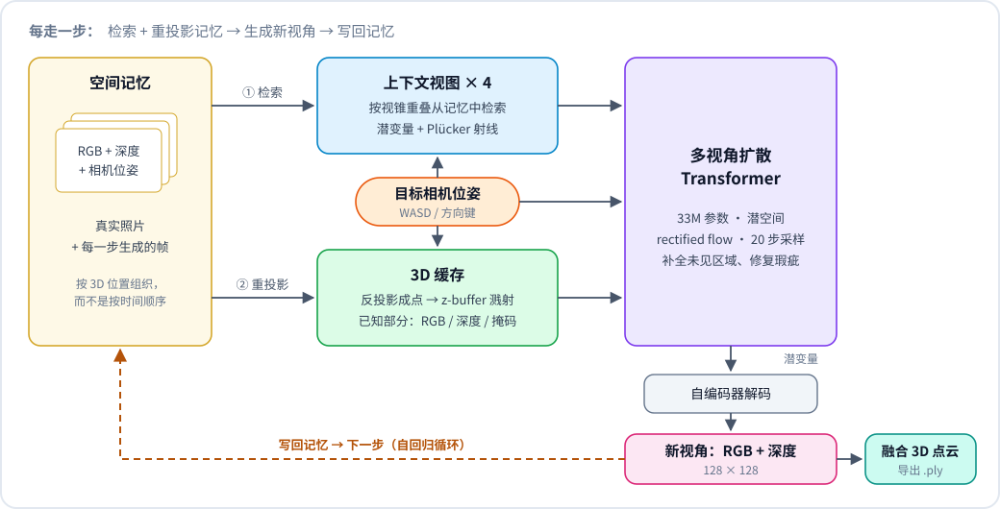
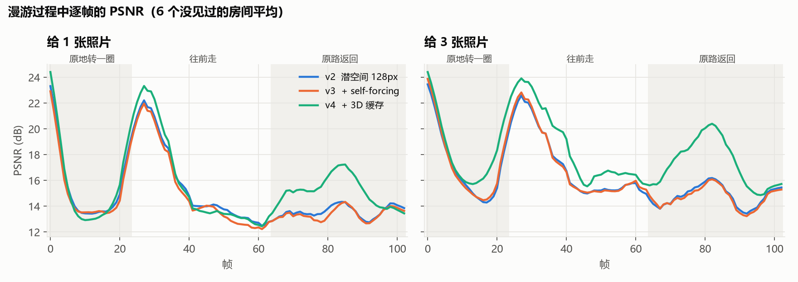
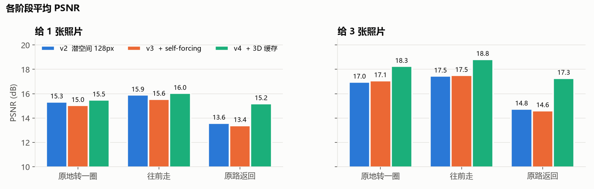
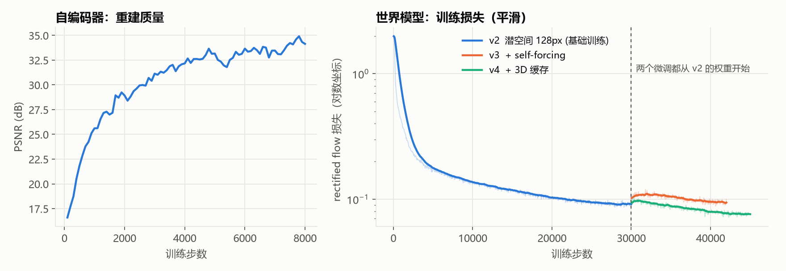

# mini-world-model

[English](README.md) | **中文**

一个我从零搭起来、在笔记本上训练的小型空间世界模型，用来弄清楚 World Labs [Atlas](https://www.worldlabs.ai/blog/atlas)
这类模型是怎么工作的。

**带位姿的 RGB-D 视图 → Plücker 相机射线 → 多视角 Transformer → 潜空间 rectified flow →
自回归生成新视角 → 空间记忆 + 3D 缓存 → 融合点云**

给它一张从没见过的房间照片，然后用 WASD 走动：每走一步，它生成新视角的画面和深度，写回记忆，探索过的房间慢慢变成一个 3D 点云。


完整演示视频（68 秒，3 个场景）：[assets/demo.mp4](assets/demo.mp4)。每一帧左边大图是生成的画面，右边依次是真实画面
（模型看不到）、3D 缓存（模型对这个视角已经知道的内容）、生成的深度，以及融合点的俯视地图。

> [!NOTE]
> 这是我用来梳理思路、研究架构的个人项目，与 World Labs 无关。Atlas 没有公开论文和代码，这里的设计是按领域里常见的
> 做法推测的，不代表 Atlas 的真实实现。
>
> 全部工作都在一台笔记本上完成（RTX 4060，8GB 显存）：数据是程序生成的简单房间，训练总共约 5 个 GPU 小时。
> 在这个规模下效果很有限——分辨率 128×128，没见过的地方经常糊成色块，物体会变形，真实照片处理不了。
> 效果这块我没法保证，做这个是想把关键设计自己从头实现一遍，并测出每个设计到底起了多大作用。

## 快速开始

```bash
git clone https://github.com/lyk555/mini-world-model.git
cd mini-world-model
python -m venv .venv
.venv/Scripts/python -m pip install torch --index-url https://download.pytorch.org/whl/cu126
.venv/Scripts/python -m pip install -r requirements.txt
```

（Linux / macOS 用 `.venv/bin/python`。）需要 NVIDIA 显卡。

从 [Releases](https://github.com/lyk555/mini-world-model/releases) 下载 `mini-world-model-128-cache.pt`（约 70 MB，
包含世界模型和自编码器），放到 `runs/latent128_cache/ema.pt`，然后：

```bash
.venv/Scripts/python explore.py              # 从一张照片出发，探索没见过的房间
.venv/Scripts/python explore.py --imagine    # 不给照片，让模型凭空想象一个房间
```

按键：**W/S** 或 **↑/↓** 前后走 · **A/D** 或 **←/→** 转 15° · **Q/E** 平移 · **R/F** 抬头/低头 ·
**G** 显示/隐藏真实画面 · **N** 换房间 · **P** 保存点云 `.ply` · **Esc** 退出

在我的笔记本上每步约 0.35 秒。可以先原地转一圈，再走开，最后走回来，看房间是不是还是原来的样子。
（按键没反应的话，先点一下窗口；中文输入法下可以切英文或者用方向键。）

```bash
.venv/Scripts/python rollout.py --seed 7 --inputs 3   # 离线跑一条轨迹并和真值对比，输出 GIF、.ply 和 PSNR
```

用浏览器打开 [`viewer.html`](viewer.html)，把两个 `.ply` 拖进去，可以并排对比生成的 3D 世界和真实的。

## 原理

<p align="center"></p>

**1. 数据：GPU 上渲染的随机房间**（`miniatlas/scene.py`）。每个样本是一个随机大小的房间，墙和地板有条纹、棋盘格、
挂画、地毯，里面有 2~8 个方块和球体，点光源带阴影。全部在 PyTorch 里做解析光线求交，所以 RGB、深度和相机位姿都是精确的。
加上 `torch.compile` 后，128×128 每秒能渲染约 2000 张，比训练消耗得还快，所以每个 batch 都是全新的世界，模型没法死记。
有精确的真值，每一处改动的效果也都能量化。

**2. 潜空间**（`miniatlas/autoencoder.py`）。一个小的卷积自编码器把每张 128×128 的 RGB-D 压成 32×32×8 的潜变量
（重建 PSNR 约 34 dB）。扩散在潜空间里做，128px 模型的 token 数因此和我最早的 64px 像素空间模型一样。

**3. 相机是几何输入，不是文字**（`miniatlas/camera.py`）。每个像素的 Plücker 射线 `(d, o × d)` 作为 6 个额外通道。
所有射线都表达在目标相机下方的重力对齐坐标系里（原点在它正下方的地面，z 指向它的朝向，y 朝上）：
和站在哪、朝哪个方向无关，但保留了高度和俯仰。

**4. 多视角扩散 Transformer**（`miniatlas/model.py`、`miniatlas/flow.py`）。带噪声的目标视图和最多 4 张上下文视图放进
同一个序列做全注意力。没有帧序号嵌入，上下文是一个无序集合，唯一的位置信息就是射线，这就是这里说的"空间上下文"。
目标视图用细 patch（256 个 token），上下文用粗 patch（每张 64 个）。adaLN-Zero、QK-norm、rectified flow、
20 步 Euler 采样、CFG 1.5。训练时给上下文加随机噪声并告诉模型加了多少，让它不要盲目相信自己生成的、有点偏差的帧。

**5. 空间记忆**（`miniatlas/world.py`）。每张观察到的或生成的视图都连同位姿存起来。选上下文时，把每帧的深度反投影成
3D 点、投到新相机里，挑覆盖最好的 4 帧。上下文按"在哪"选，而不是按"什么时候"。

**6. 显式 3D 缓存**（`miniatlas/cache.py`）。这是作用最大的一步。把所有真实照片和最相关的 12 帧生成帧按深度反投影，
再用 z-buffer 溅射到新相机里，得到一张"已知部分"的图（RGB + 深度 + 覆盖掩码，没见过的地方是空洞），通过一个零初始化的
层输入给目标 token。看过的东西按几何直接搬过来，模型只需要补洞。思路和 GEN3C 的 3D cache 一样。

<p align="center"><br>
<sub>训练预览。每行：4 个上下文视图（灰 = 无）| 3D 缓存 | 真实目标 | 生成结果 | 真实深度 | 生成深度。
第一行没有任何上下文，完全是想象。</sub></p>

## 结果

测试方式：给模型 1 或 3 张没见过的房间照片，让它沿固定路线自己生成 103 帧——原地转一圈、往前走 40 步、原路走回来——
每一帧都和真实渲染对比。走回来的时候，记忆里已经有几十帧是模型自己生成的，漂移主要体现在这一段。

<p align="center"><br>
<sub>同样的房间、同样的路线。奇数行：v2（只有空间记忆）；偶数行：v4（加了 3D 缓存）。
每对图：真实 | 生成，取第 30 / 50 / 70 / 90 / 102 帧。</sub></p>

<p align="center"></p>

<p align="center"><br>
<sub>v2：128px 潜空间模型 + 空间记忆。v3：在 v2 基础上用自己生成的帧微调（self-forcing）。
v4：在 v2 基础上加 3D 缓存微调。self-forcing 没有起作用；3D 缓存的收益主要在"原路返回"这段，
也就是回到自己生成过的地方时。</sub></p>

只给 1 张照片时，房间大部分地方都没见过，模型会想象出合理但不一样的东西（比如把方块想成一幅画），PSNR 会把这算成错误，
所以 1 张照片的数字偏低。

<p align="center"><br>
<sub>左：自编码器 8000 步后重建 PSNR 约 34 dB。右：世界模型的训练损失；两个微调都从第 30000 步的 v2 权重开始
（它们的损失不能直接比较——v3 的上下文更难，v4 多了一路输入）。</sub></p>

## 从零训练

时间都是在 RTX 4060 Laptop (8GB) 上测的。

```bash
# 1. 自编码器：128×128 RGB-D -> 32×32×8 潜变量（约 30 分钟）
.venv/Scripts/python train_ae.py --out runs/ae128 --res 128 --steps 8000

# 2. 潜空间世界模型（约 2.3 小时）
.venv/Scripts/python train.py --out runs/latent128 --ae runs/ae128/ae.pt --steps 30000

# 3. 加 3D 缓存微调（约 1 小时）
.venv/Scripts/python train.py --out runs/latent128_cache --ae runs/ae128/ae.pt \
    --init runs/latent128/latest.pt --cache_extra 4 --bs 16 --steps 15000 --lr 1e-4 --warmup 200
```

每 1000 步会在 `runs/<名字>/preview_XXXXXX.png` 存一张预览图，中断后重新运行同一条命令会从 `latest.pt` 续训。
64px 像素空间版本是 `train.py --out runs/main --steps 30000`，self-forcing 的命令在 `train.py` 开头。
重新录演示视频：`python make_demo.py --lang zh`。

## 和真实 Atlas 的差别

| | mini-world-model | Atlas |
|---|---|---|
| 规模 | 128×128，3300 万参数，约 5 GPU 小时 | 最高 1440p，参数量未公开 |
| 数据 | 程序生成的房间 | 真实的图像、视频、位姿、深度 |
| 潜空间 | 在合成房间上训练的小自编码器 | latent diffusion，细节未公开 |
| 位姿编码 | Plücker 射线（我的推测） | 未公开 |
| 记忆 | 检索 4 张视图 + 点云 3D 缓存 | 空间上下文，细节未公开 |
| 推理 | 每步重算整条序列 | KV cache 等 LLM 推理技术 |

## 局限

- 只在合成房间上训练过，处理不了真实照片。要往真实场景走，得有带位姿的真实视频（RealEstate10K、DL3DV）、
  好得多的 VAE，以及多一两个数量级的算力。
- 3D 缓存保证一致，不保证好看：没见过的区域如果第一次就生成成了色块，之后会一直是色块。物体边缘也偏软。
- 128×128、每步约 0.35 秒，离流畅的实时还远。一致性蒸馏把采样压到 4 步左右是我接下来最想试的。
- 缓存现在是直接点溅射，换成 3D 高斯会干净不少，导出的 3D 也会更好。
- 评测只跑了 6 个房间，数字波动不小，表里的结论看个趋势就好。

## 参考

- World Labs, [*Atlas*](https://www.worldlabs.ai/blog/atlas)（2026）——灵感来源（本项目不是官方实现）
- Peebles & Xie, *Scalable Diffusion Models with Transformers (DiT)* — [arXiv:2212.09748](https://arxiv.org/abs/2212.09748)
- Liu et al., *Flow Straight and Fast: Rectified Flow* — [arXiv:2209.03003](https://arxiv.org/abs/2209.03003)
- Esser et al., *Scaling Rectified Flow Transformers for High-Resolution Image Synthesis (SD3)* — [arXiv:2403.03206](https://arxiv.org/abs/2403.03206)
- Gao et al., *CAT3D: Create Anything in 3D with Multi-View Diffusion Models* — [arXiv:2405.10314](https://arxiv.org/abs/2405.10314)
- Ren et al., *GEN3C: 3D-Informed World-Consistent Video Generation with Precise Camera Control* — [arXiv:2503.03751](https://arxiv.org/abs/2503.03751)
- Chen et al., *Diffusion Forcing: Next-token Prediction Meets Full-Sequence Diffusion* — [arXiv:2407.01392](https://arxiv.org/abs/2407.01392)
- Alonso et al., *Diffusion for World Modeling: Visual Details Matter in Atari (DIAMOND)* — [arXiv:2405.12399](https://arxiv.org/abs/2405.12399)
- Bruce et al., *Genie: Generative Interactive Environments* — [arXiv:2402.15391](https://arxiv.org/abs/2402.15391)
- Valevski et al., *Diffusion Models Are Real-Time Game Engines (GameNGen)* — [arXiv:2408.14837](https://arxiv.org/abs/2408.14837)

## License

[MIT](LICENSE)
